# 🍽️ Cardápio Digital com Painel de Gerenciamento

Sistema web completo para restaurantes e lanchonetes, permitindo que clientes acessem o cardápio via QR Code e que os administradores gerenciem o conteúdo de forma intuitiva e responsiva.

---

## ✨ Funcionalidades

### 🔐 Autenticação
- Login com validação
- Esqueci minha senha com envio de e-mail
- Autenticação com **JWT**

### 📱 Interface do Cliente
- Acesso via QR Code
- **Exclusivamente adaptado para dispositivos móveis**
- Tema escuro e claro
- Pesquisa com **autocomplete**
- Filtros por **preço** e **categoria**
- Paginação dos itens

### 🛠️ Painel Administrativo
- Cadastro, edição e exclusão de itens do cardápio
- Adição e exclusão de categorias
- Upload de imagens para o **Firebase Storage**
- Formulários com validação via **React Hook Form**

---

## ⚙️ Tecnologias Utilizadas

### 💻 Front-end
- React + TypeScript
- Redux
- React Router
- React Hook Form
- Framer Motion
- Tailwind CSS + Sass

### 🔙 Back-end
- Node.js + Express
- MongoDB
- Firebase Storage
- JWT para autenticação

---

## 🔗 Acesso à Demonstração

- 📲 **Cardápio (interface cliente):**
  
  👉 [https://digital-menu-client-rose.vercel.app/](https://digital-menu-client-rose.vercel.app/)

- 📱 **Acesse via QR Code:**
  
  

> ⚠️ **Observações importantes:**
> - O cardápio foi desenvolvido **exclusivamente para uso em dispositivos móveis**.
> - **Este projeto está em versão inicial e ainda está em processo de melhorias contínuas.**  
> Funcionalidades adicionais e ajustes de usabilidade estão planejados para versões futuras.
> - O servidor está hospedado com o plano gratuito da **Render**, que entra em modo de hibernação após inatividade. O primeiro acesso pode demorar alguns segundos.
> - **Todas as imagens do sistema são ilustrativas** (itens genéricos como hambúrgueres).

---

## 🎞️ Funcionalidades em ação (GIFs)

| Autocomplete | Filtro por preço | Paginação |
|-------------|------------------|-----------|
| 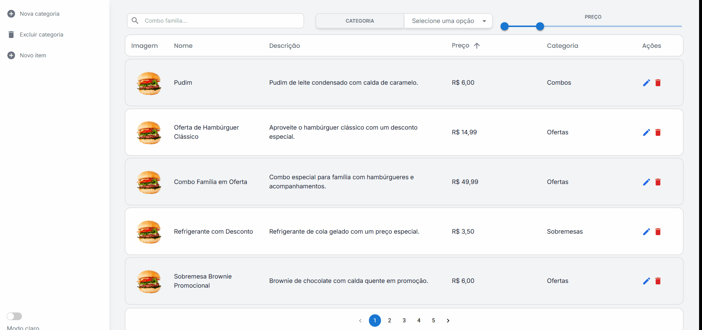 | 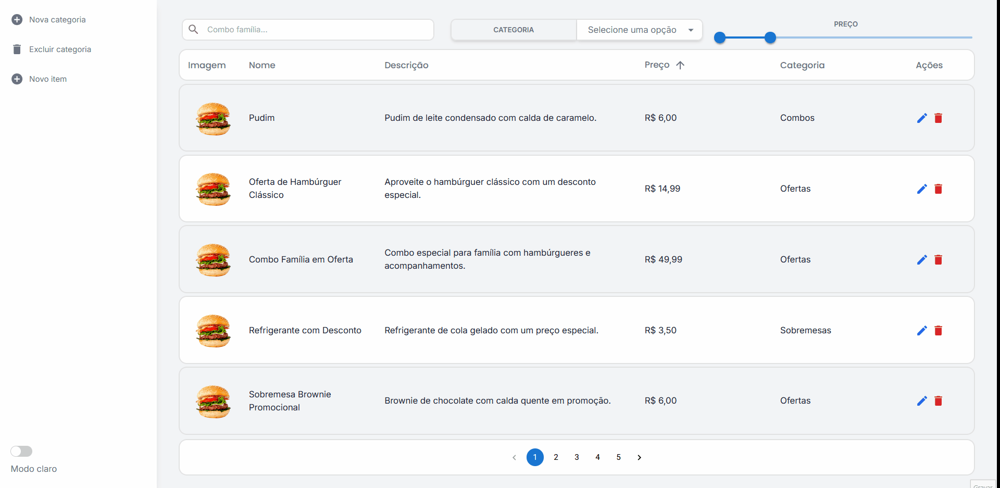 | 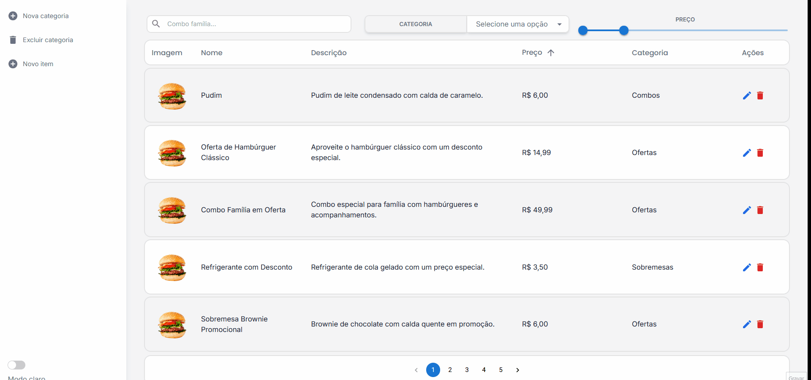 |

| Tema Claro/Escuro | Responsividade 01 | Responsividade 02 |
|-------------------|-------------------|-------------------|
| 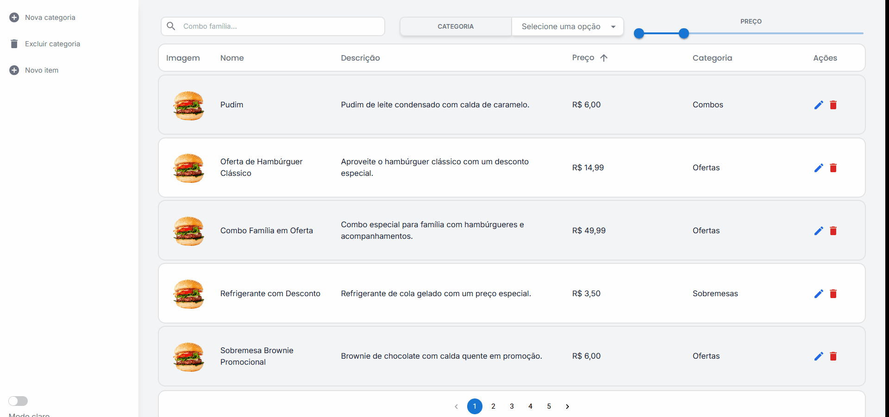 | 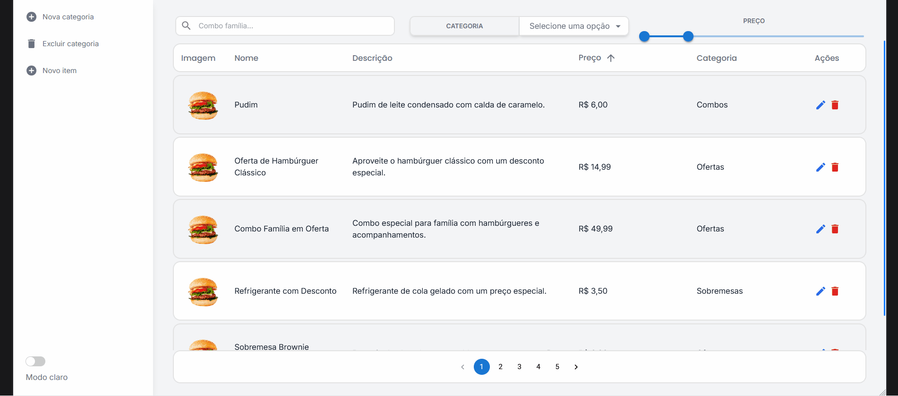 |  |

| Seleção de Imagem | Recuperação de Senha (GIF) |
|-------------------|----------------------------|
| 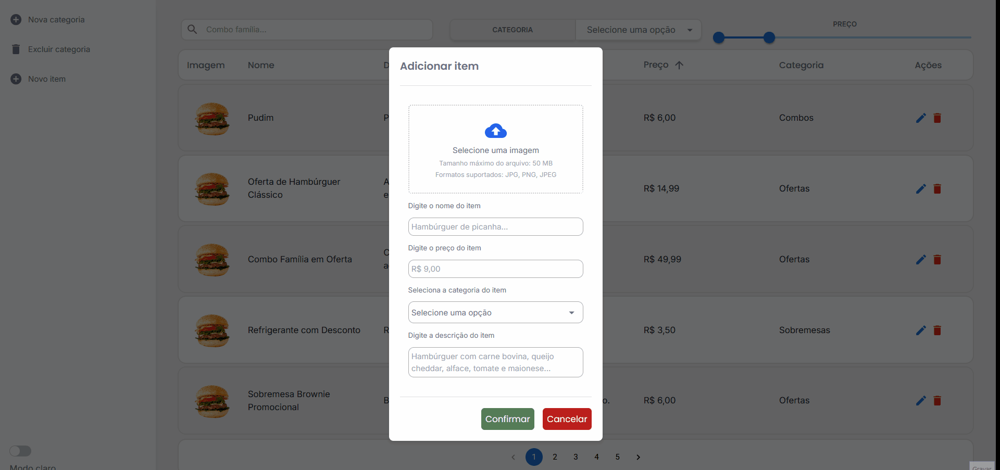 | 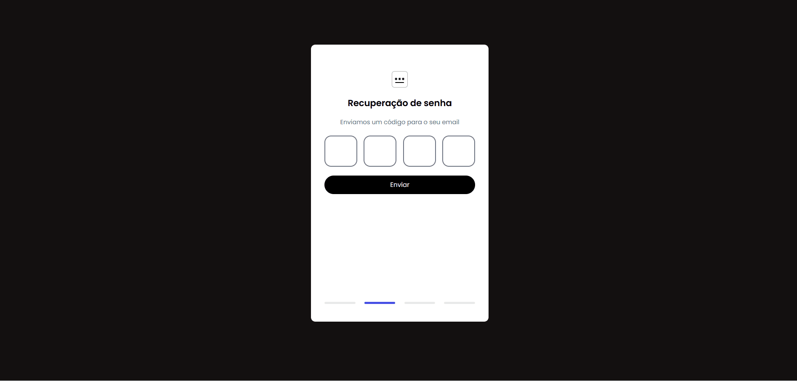 |

---

## 🖼️ Screenshots (painel e etapas)

| Login | Nova Categoria | Excluir Categoria |
|-------|----------------|-------------------|
| 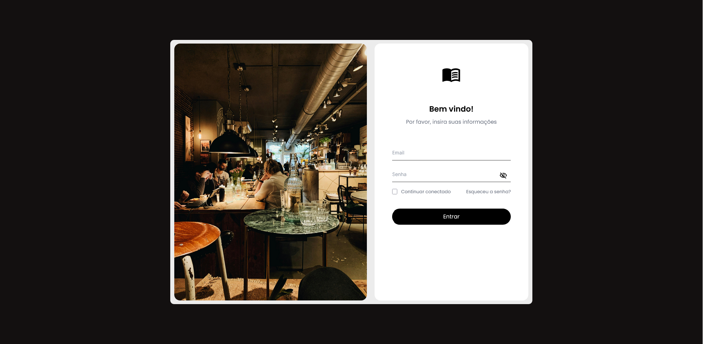 | 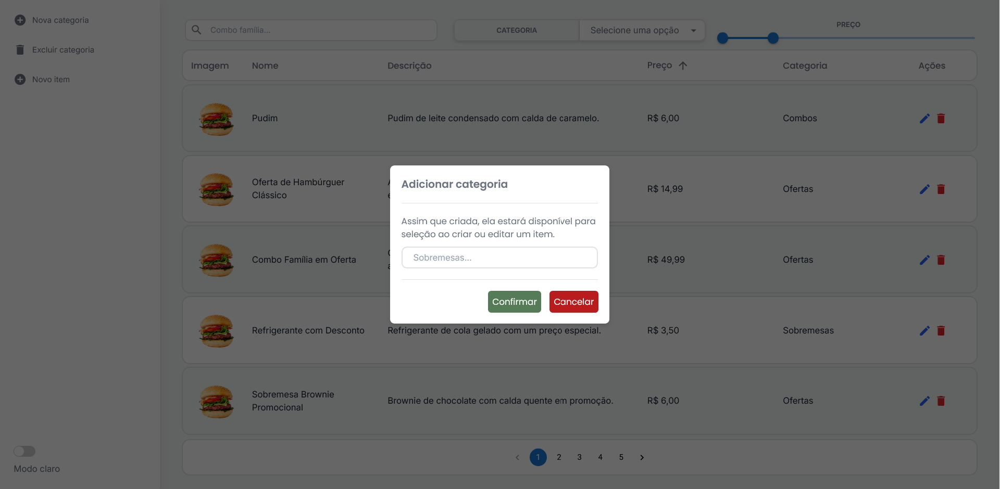 | 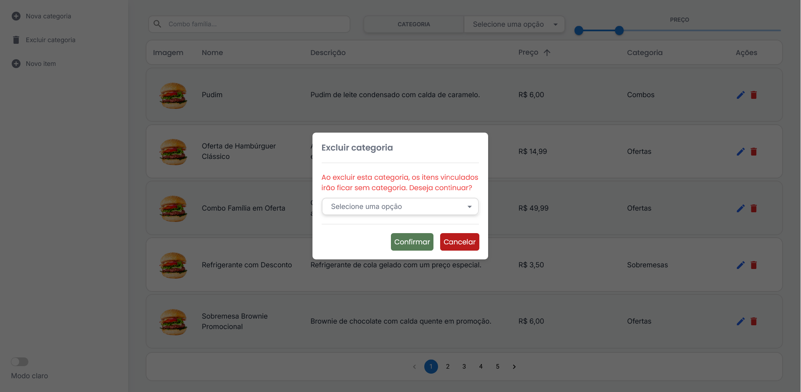 |

| Excluir Item | Editar Item |
|--------------|-------------|
| 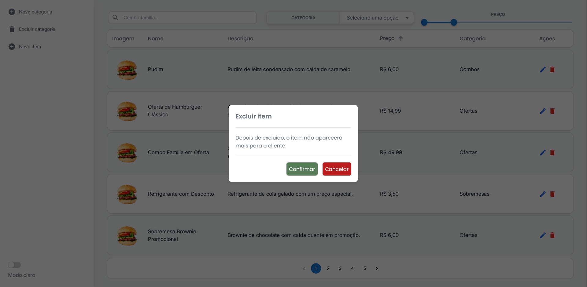 | 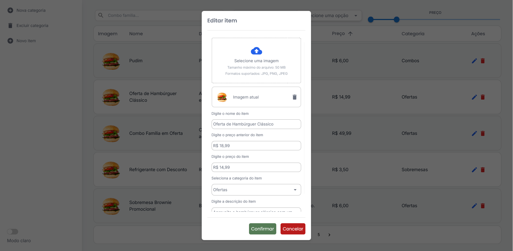 |

### Etapas do "Esqueci minha senha"

| Etapa 1 | Etapa 2 | Etapa 3 |
|---------|---------|---------|
| 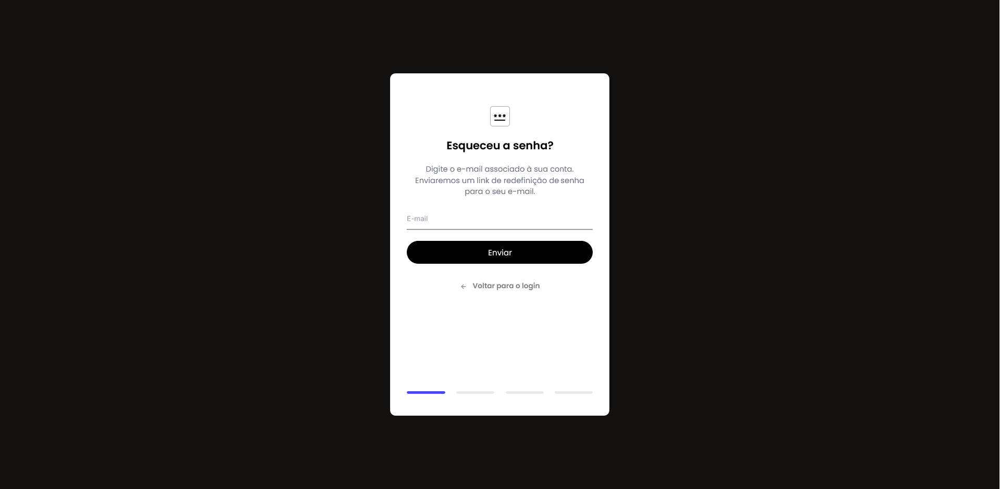 | 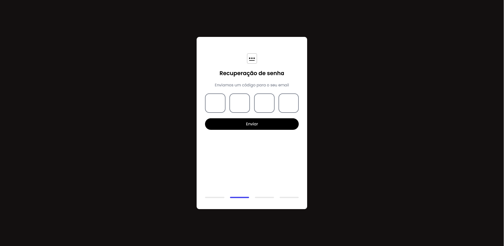 | 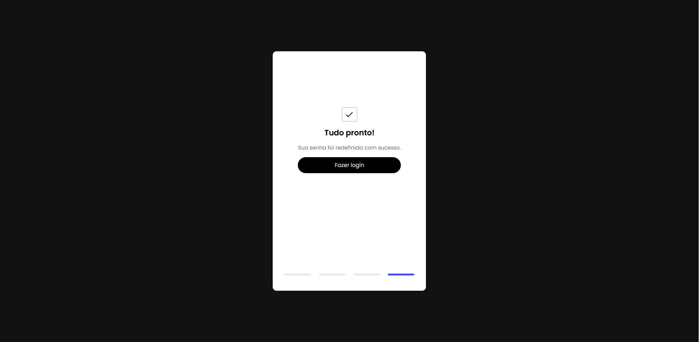 |

---

## ⚠️ Código-fonte

O código-fonte deste projeto **não está disponível** por se tratar de uma solução comercial fechada.  
Este repositório é **apenas para fins demonstrativos**.

---

## 📬 Contato

- [LinkedIn](https://www.linkedin.com/in/juan-gabriel-sa/)
- 📧 juangabrielsa147@gmail.com
